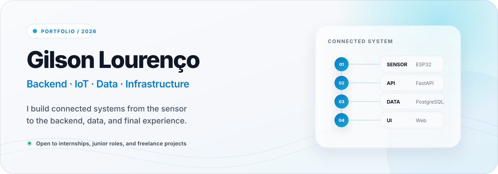

  

  
  

## 01 / About

I am a Systems Analysis and Development student in Barueri, São Paulo, currently completing technical training in IT Maintenance and Support.

What interests me most is the path between parts: how a sensor becomes reliable data, how an API turns that data into something useful, and how the final interface makes the whole system understandable. That is why my work naturally crosses backend development, IoT, databases, networking, and user experience.

I learn by building real things, documenting the decisions, and going back to improve what did not work the first time.

> **Currently open to:** internships, apprenticeships, junior roles, and freelance projects in software development, data, IoT, technical support, or networking.

## 02 / Selected work

### PMCA — Water Consumption Monitoring

An end-to-end system built to make water use easier to measure and understand. It connects ESP32 telemetry to a Python API, PostgreSQL storage, authentication, and a responsive monitoring dashboard.

**My focus:** system integration, backend architecture, telemetry, data modeling, and interface decisions.

[Explore the repository →](https://github.com/pyramdg/pmca-monitoramento-agua)

---

### Personal Portfolio

A responsive portfolio designed as a set of project case studies, with light and dark themes, accessible interactions, and a visual system inspired by calm, focused product interfaces.

**My focus:** semantic HTML, responsive CSS, interaction design, accessibility, and clear technical storytelling.

[View the live portfolio →](https://gilson-lourenco-portfolio.gilsonlourenco946.chatgpt.site) · [Explore the repository →](https://github.com/pyramdg/portfolio)

---

### Advanced Registration System

A Django learning project where I practiced the relationship between routes, views, models, templates, forms, and database-backed interfaces.

**My focus:** Python, Django fundamentals, project structure, and incremental learning.

[Explore the repository →](https://github.com/pyramdg/advanced_registration_system_project)

## 03 / Tools I use

  
  
  
  
  
  
  
  
  
  
  

| Area | Experience |
|---|---|
| **Backend** | Python, FastAPI, Django, Flask, REST APIs, SQLAlchemy |
| **Data** | PostgreSQL, SQL, pandas, scikit-learn, Power BI |
| **IoT** | ESP32, Arduino, sensors, LittleFS, HTTPS telemetry |
| **Infrastructure** | Networking, hardware maintenance, Linux, Git, security fundamentals |
| **Web** | Semantic HTML, CSS, JavaScript, responsive design, accessibility |

## 04 / Learning path

- **Systems Analysis and Development**
- **IT Maintenance and Support** — FIEB
- **Cisco Networking Academy** — IT Essentials, CCNA 1, and CyberOps
- **DataCamp** — practical machine learning studies
- **Microsoft Learn** — cloud fundamentals, Python, and Microsoft 365

My current goal is to deepen my backend and data skills while continuing to work across the full system — from hardware and network constraints to the experience people see on screen.

## 05 / Current focus

- Strengthening backend architecture with Python, FastAPI, Django, and PostgreSQL.
- Improving the PMCA platform from telemetry and data integrity to the final dashboard.
- Studying machine learning through practical projects and documented experiments.
- Refining each repository so the problem, decisions, and learning are easy to understand.

  Building carefully, learning in public, and improving one version at a time.

